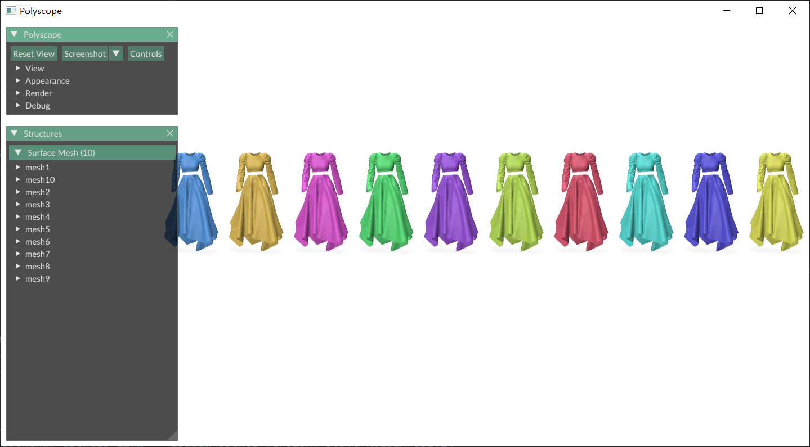
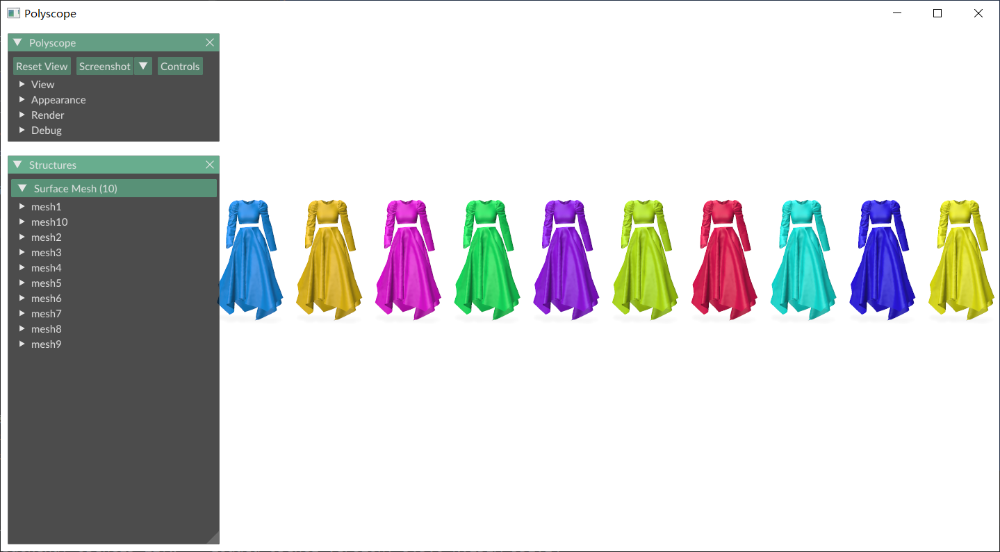
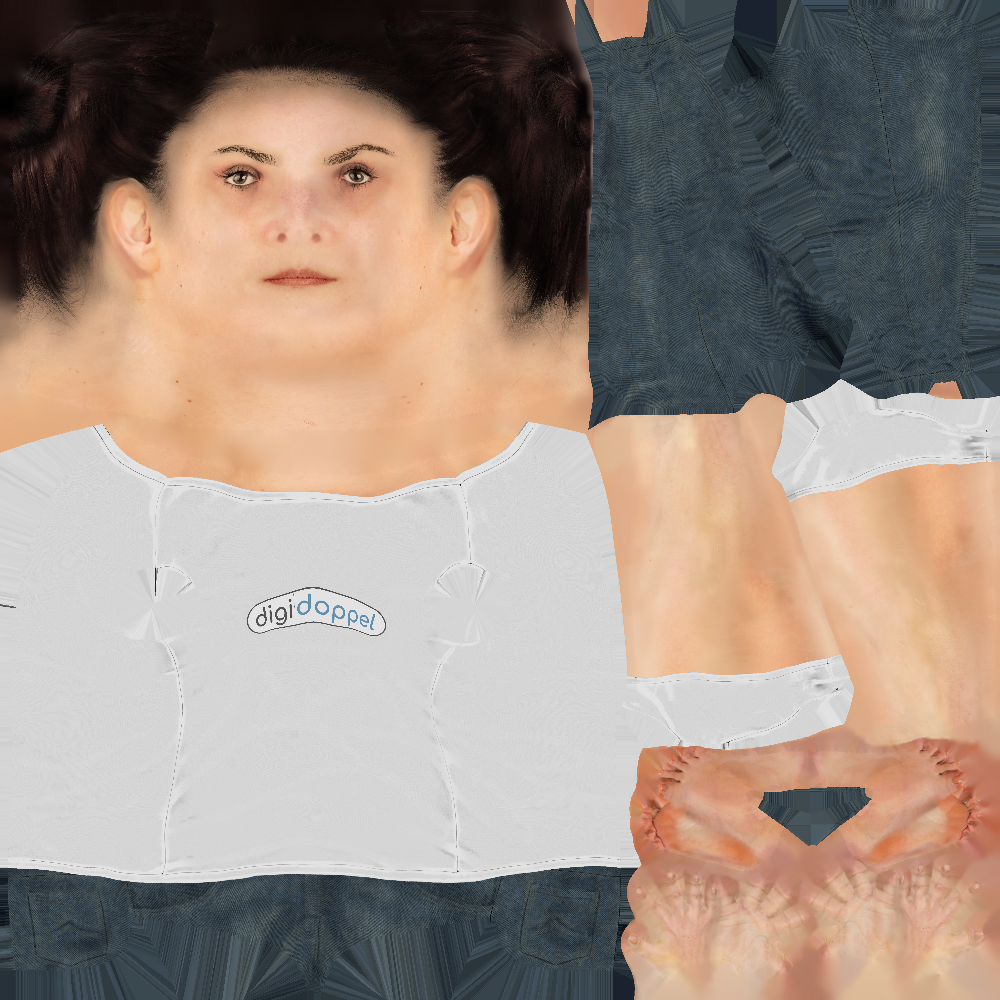
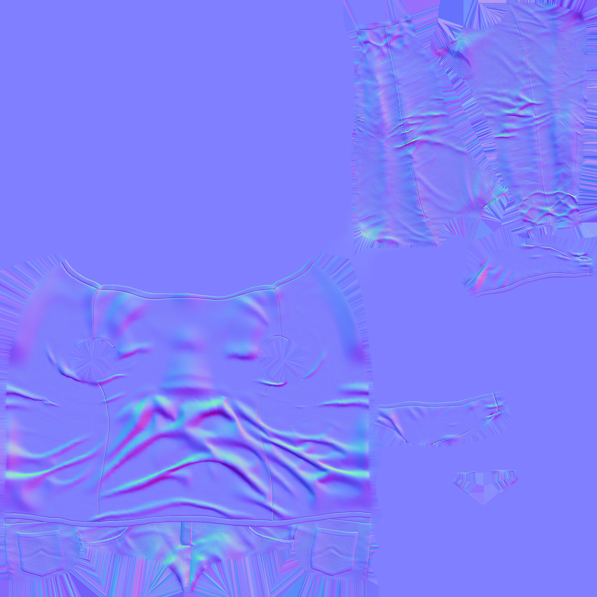

## 1 polyscope常用可视化
### 1.1 可视化mesh

```python
import igl
import polyscope as ps
import numpy as np

v,f = igl.read_triangle_mesh("assets/bunny.obj")

ps.init()
ps.register_surface_mesh("mesh", v,f,
                         color=np.array([0, 91, 255]) / 255,
                         edge_width=0.3,
                         edge_color=[1, 1, 1],
                         smooth_shade=True,
                         # material="flat"
                         )

ps.set_view_projection_mode("perspective")  # orthographic 正交投影   perspective 透视投影
# ps.set_navigation_style("planar")  # ['turntable','free','planar','none','first_person']
ps.set_ground_plane_mode("shadow_only")  # ['none','tile','tile_reflection','shadow_only']
# ps.set_ground_plane_height(-0.001)  # 设置地平面高度
ps.set_shadow_blur_iters(3)  # 设置地平面阴影模糊程度
ps.set_shadow_darkness(0.5)  # 设置地平面阴影明暗程度
ps.set_up_dir("y_up")  # 设置y轴正方向向上（这个和设置视角会冲突，因此在添加视角参数时，这一行要注释掉）
ps.set_front_dir('z_front')  # 设置z轴正方向向前
ps.set_SSAA_factor(4) # 在截图时，设置为4时，截图会更清晰
ps.show()

```


### 1.2 可视化点云

```python
import polyscope as ps
import numpy as np

points = np.loadtxt("assets/bunny.txt")

ps.init()
ps.register_point_cloud("points", points,
                        color=np.array([0, 91, 255]) / 255,
                        radius=0.003)

ps.set_view_projection_mode("perspective")  # orthographic 正交投影   perspective 透视投影
# ps.set_navigation_style("planar")  # ['turntable','free','planar','none','first_person']
ps.set_ground_plane_mode("shadow_only")  # ['none','tile','tile_reflection','shadow_only']
# ps.set_ground_plane_height(-0.001)  # 设置地平面高度
ps.set_shadow_blur_iters(3)  # 设置地平面阴影模糊程度
ps.set_shadow_darkness(0.5)  # 设置地平面阴影明暗程度
ps.set_up_dir("y_up")  # 设置y轴正方向向上（这个和设置视角会冲突，因此在添加视角参数时，这一行要注释掉）
ps.set_front_dir('z_front')  # 设置z轴正方向向前
ps.set_SSAA_factor(4) # 在截图时，设置为4时，截图会更清晰
ps.show()
```


### 1.3 可视化线框


```python
import igl
import polyscope as ps
import numpy as np

v,f = igl.read_triangle_mesh("assets/bunny.obj")

e = igl.edges(f)

# 获得节点 和 连接关系
nodes = v[e].reshape(-1, 3)
edges = np.arange(nodes.shape[0]).reshape(-1, 2)

ps.init()
ps.register_surface_mesh("mesh", v,f,
                         color=np.array([0, 91, 255]) / 255,
                         edge_width=0.0003,
                         edge_color=[1, 1, 1],
                         smooth_shade=True,
                         # material="flat"
                         )

ps.register_curve_network("wireframe", nodes, edges,
                          color=[1, 1, 1],
                          radius=0.001
                          )

ps.set_view_projection_mode("perspective")  # orthographic 正交投影   perspective 透视投影
# ps.set_navigation_style("planar")  # ['turntable','free','planar','none','first_person']
ps.set_ground_plane_mode("shadow_only")  # ['none','tile','tile_reflection','shadow_only']
# ps.set_ground_plane_height(-0.001)  # 设置地平面高度
ps.set_shadow_blur_iters(3)  # 设置地平面阴影模糊程度
ps.set_shadow_darkness(0.5)  # 设置地平面阴影明暗程度
ps.set_up_dir("y_up")  # 设置y轴正方向向上（这个和设置视角会冲突，因此在添加视角参数时，这一行要注释掉）
ps.set_front_dir('z_front')  # 设置z轴正方向向前
ps.set_SSAA_factor(4) # 在截图时，设置为4时，截图会更清晰
ps.show()

```

|  |  |
| :---------------------------------------------: | :---------------------------------------------: |
|                 mesh+wireframe                  |                    wireframe                    |


## 2 polyscope颜色设置

### 2.1 调亮颜色

```python
蓝色[0, 91/255, 255/ 255]   
黄色[255/ 255, 164/ 255, 0]   
粉红色[255/ 255, 0, 218/ 255]   
青色[0, 255/ 255, 37/ 255]  
紫色[100/ 255, 0, 255/ 255] 
草黄[155/ 255, 255/ 255, 0] 
红色[255/ 255, 0, 27/ 255] 
玉色[0, 255/ 255, 228/ 255] 
深蓝[5/ 255, 0, 255/ 255]
亮黄[255/ 255, 255/ 255, 0] 
```


### 2.2 默认10种颜色

如果不设置颜色，使用的就是默认颜色，默认的颜色有一点暗

```python
import igl
import numpy as np
import polyscope as ps

v, f = igl.read_triangle_mesh("assets/dress2.obj")

ps.init()
ps.register_surface_mesh("mesh1", v, f,
                         # color=np.array([0, 91, 255]) / 255,
                         smooth_shade=True)
ps.register_surface_mesh("mesh2", v + np.array([1000, 0, 0]), f,
                         # color=np.array([255,164,0] ) /255,
                         smooth_shade=True)
ps.register_surface_mesh("mesh3", v + np.array([2000, 0, 0]), f,
                         # color=np.array([255, 0, 218]) / 255,
                         smooth_shade=True)
ps.register_surface_mesh("mesh4", v + np.array([3000, 0, 0]), f,
                         # color=np.array([0, 255, 37]) / 255,
                         smooth_shade=True)
ps.register_surface_mesh("mesh5", v + np.array([4000, 0, 0]), f,
                         # color=np.array([100, 0, 255]) / 255,
                         smooth_shade=True)
ps.register_surface_mesh("mesh6", v + np.array([5000, 0, 0]), f,
                         # color=np.array([155, 255, 0]) / 255,
                         smooth_shade=True)
ps.register_surface_mesh("mesh7", v + np.array([6000, 0, 0]), f,
                         # color=np.array([255, 0, 27]) / 255,
                         smooth_shade=True)
ps.register_surface_mesh("mesh8", v + np.array([7000, 0, 0]), f,
                         # color=np.array([0, 255, 228]) / 255,
                         smooth_shade=True)
ps.register_surface_mesh("mesh9", v + np.array([8000, 0, 0]), f,
                         # color=np.array([5, 0, 255]) / 255,
                         smooth_shade=True)
ps.register_surface_mesh("mesh10", v + np.array([9000, 0, 0]), f,
                         # color=np.array([255, 255, 0]) / 255,
                         smooth_shade=True)

ps.set_ground_plane_mode("shadow_only")
# ps.set_navigation_style("planar")
ps.set_up_dir("y_up")
ps.set_view_projection_mode("orthographic")  # orthographic 正交投影   perspective 透视投影
ps.set_SSAA_factor(4)
ps.show()
```




### 2.3 调亮10种颜色

```python
import igl
import numpy as np
import polyscope as ps

v, f = igl.read_triangle_mesh("assets/dress2.obj")

# 调亮
# 蓝色 [0,91,255] / 255# 黄色 [255,164,0] / 255# 粉红色 [255,0, 218 ] / 255# 青色 [0,255,37] / 255# 紫色 [100, 0, 255]/ 255# 草黄 [155,255,0] / 255# 红色 [255,0,27] / 255# 玉色 [0,255,228] / 255# 深蓝 [5,0,255] / 255# 亮黄 [255,255,0] / 255

ps.init()
ps.register_surface_mesh("mesh1", v, f,
                         color=np.array([0, 91, 255]) / 255,
                         smooth_shade=True)
ps.register_surface_mesh("mesh2", v + np.array([1000, 0, 0]), f,
                         color=np.array([255, 164, 0]) / 255,
                         smooth_shade=True)
ps.register_surface_mesh("mesh3", v + np.array([2000, 0, 0]), f,
                         color=np.array([255, 0, 218]) / 255,
                         smooth_shade=True)
ps.register_surface_mesh("mesh4", v + np.array([3000, 0, 0]), f,
                         color=np.array([0, 255, 37]) / 255,
                         smooth_shade=True)
ps.register_surface_mesh("mesh5", v + np.array([4000, 0, 0]), f,
                         color=np.array([100, 0, 255]) / 255,
                         smooth_shade=True)
ps.register_surface_mesh("mesh6", v + np.array([5000, 0, 0]), f,
                         color=np.array([155, 255, 0]) / 255,
                         smooth_shade=True)
ps.register_surface_mesh("mesh7", v + np.array([6000, 0, 0]), f,
                         color=np.array([255, 0, 27]) / 255,
                         smooth_shade=True)
ps.register_surface_mesh("mesh8", v + np.array([7000, 0, 0]), f,
                         color=np.array([0, 255, 228]) / 255,
                         smooth_shade=True)
ps.register_surface_mesh("mesh9", v + np.array([8000, 0, 0]), f,
                         color=np.array([5, 0, 255]) / 255,
                         smooth_shade=True)
ps.register_surface_mesh("mesh10", v + np.array([9000, 0, 0]), f,
                         color=np.array([255, 255, 0]) / 255,
                         smooth_shade=True)

ps.set_ground_plane_mode("shadow_only")
# ps.set_navigation_style("planar")
ps.set_up_dir("y_up")
ps.set_view_projection_mode("orthographic")  # orthographic 正交投影   perspective 透视投影
ps.set_SSAA_factor(4)
ps.show()
```





## 3 读写mesh

### 3.1 python读写mesh

```python
import polyscope as ps
import numpy as np
import os

def read_obj(file_path):
    vertices = []
    faces = []

    with open(file_path, 'r') as f:
        for line in f:
            line = line.strip()
            if line.startswith('v '):  # 顶点
                parts = line.split()
                vertices.append([float(x) for x in parts[1:4]])
            elif line.startswith('f '):  # 面
                parts = line.split()
                face = []
                for item in parts[1:]:
                    # 取第一个数字（顶点索引），并转换为0-based索引
                    idx = int(item.split('/')[0])
                    # OBJ文件索引从1开始，转换为0-based
                    if idx > 0:
                        face.append(idx - 1)  # 正索引减1
                    else:
                        # 处理负数索引（相对于末尾）
                        face.append(len(vertices) + idx)
                faces.append(face)

    return np.array(vertices),np.array(faces)


def save_obj(filename, vertices, faces):
    os.makedirs(os.path.dirname(filename), exist_ok=True)

    with open(filename, 'w') as fp:
        for v in vertices:
            fp.write('v %f %f %f\n' % (v[0], v[1], v[2]))

        for f in (faces + 1):  # Faces are 1-based, not 0-based in obj files
            fp.write('f %d %d %d\n' % (f[0], f[1], f[2]))

    print("Saved:", filename)


# 读取mesh
v,f = read_obj("assets/bunny.obj")

# 可视化mesh
ps.init()
ps.register_surface_mesh("mesh", v,f,
                         color=np.array([0, 91, 255]) / 255,
                         edge_width=0.3,
                         edge_color=[1, 1, 1],
                         smooth_shade=True,
                         # material="flat"
                         )

ps.set_view_projection_mode("perspective")  # orthographic 正交投影   perspective 透视投影
# ps.set_navigation_style("planar")  # ['turntable','free','planar','none','first_person']
ps.set_ground_plane_mode("shadow_only")  # ['none','tile','tile_reflection','shadow_only']
# ps.set_ground_plane_height(-0.001)  # 设置地平面高度
ps.set_shadow_blur_iters(3)  # 设置地平面阴影模糊程度
ps.set_shadow_darkness(0.5)  # 设置地平面阴影明暗程度
ps.set_up_dir("y_up")  # 设置y轴正方向向上（这个和设置视角会冲突，因此在添加视角参数时，这一行要注释掉）
ps.set_front_dir('z_front')  # 设置z轴正方向向前
ps.set_SSAA_factor(4) # 在截图时，设置为4时，截图会更清晰
ps.show()

# 写入mesh
save_obj("assets/new_bunny_python.obj",v,f)
```

### 3.2 libigl读写mesh

```python
import igl
import polyscope as ps
import numpy as np

# 读取mesh
v, f = igl.read_triangle_mesh("assets/bunny.obj")

# 可视化mesh
ps.init()
ps.register_surface_mesh("mesh", v, f,
                         color=np.array([0, 91, 255]) / 255,
                         edge_width=0.3,
                         edge_color=[1, 1, 1],
                         smooth_shade=True,
                         # material="flat"
                         )

ps.set_view_projection_mode("perspective")  # orthographic 正交投影   perspective 透视投影
# ps.set_navigation_style("planar")  # ['turntable','free','planar','none','first_person']
ps.set_ground_plane_mode("shadow_only")  # ['none','tile','tile_reflection','shadow_only']
# ps.set_ground_plane_height(-0.001)  # 设置地平面高度
ps.set_shadow_blur_iters(3)  # 设置地平面阴影模糊程度
ps.set_shadow_darkness(0.5)  # 设置地平面阴影明暗程度
ps.set_up_dir("y_up")  # 设置y轴正方向向上（这个和设置视角会冲突，因此在添加视角参数时，这一行要注释掉）
ps.set_front_dir('z_front')  # 设置z轴正方向向前
ps.set_SSAA_factor(4) # 在截图时，设置为4时，截图会更清晰
ps.show()

# 写入mesh
igl.write_triangle_mesh("assets/new_bunny_igl.obj", v, f)

```

### 3.3 trimesh读写mesh

```python
import trimesh
import polyscope as ps
import numpy as np

# 读取mesh
mesh = trimesh.load("assets/bunny.obj")
v = mesh.vertices
f = mesh.faces

# 可视化mesh
ps.init()
ps.register_surface_mesh("mesh", v,f,
                         color=np.array([0, 91, 255]) / 255,
                         edge_width=0.3,
                         edge_color=[1, 1, 1],
                         smooth_shade=True,
                         # material="flat"
                         )

ps.set_view_projection_mode("perspective")  # orthographic 正交投影   perspective 透视投影
# ps.set_navigation_style("planar")  # ['turntable','free','planar','none','first_person']
ps.set_ground_plane_mode("shadow_only")  # ['none','tile','tile_reflection','shadow_only']
# ps.set_ground_plane_height(-0.001)  # 设置地平面高度
ps.set_shadow_blur_iters(3)  # 设置地平面阴影模糊程度
ps.set_shadow_darkness(0.5)  # 设置地平面阴影明暗程度
ps.set_up_dir("y_up")  # 设置y轴正方向向上（这个和设置视角会冲突，因此在添加视角参数时，这一行要注释掉）
ps.set_front_dir('z_front')  # 设置z轴正方向向前
ps.set_SSAA_factor(4) # 在截图时，设置为4时，截图会更清晰
ps.show()

# 写入mesh
mesh.export("assets/new_bunny_trimesh.obj")

```

### 3.4 openmesh读写mesh

```python
import openmesh as om
import polyscope as ps
import numpy as np

# 读取mesh
mesh = om.read_trimesh('assets/bunny.obj')
v = mesh.points()
f = mesh.face_vertex_indices()

# 可视化mesh
ps.init()
ps.register_surface_mesh("mesh", v,f,
                         color=np.array([0, 91, 255]) / 255,
                         edge_width=0.3,
                         edge_color=[1, 1, 1],
                         smooth_shade=True,
                         # material="flat"
                         )

ps.set_view_projection_mode("perspective")  # orthographic 正交投影   perspective 透视投影
# ps.set_navigation_style("planar")  # ['turntable','free','planar','none','first_person']
ps.set_ground_plane_mode("shadow_only")  # ['none','tile','tile_reflection','shadow_only']
# ps.set_ground_plane_height(-0.001)  # 设置地平面高度
ps.set_shadow_blur_iters(3)  # 设置地平面阴影模糊程度
ps.set_shadow_darkness(0.5)  # 设置地平面阴影明暗程度
ps.set_up_dir("y_up")  # 设置y轴正方向向上（这个和设置视角会冲突，因此在添加视角参数时，这一行要注释掉）
ps.set_front_dir('z_front')  # 设置z轴正方向向前
ps.set_SSAA_factor(4) # 在截图时，设置为4时，截图会更清晰
ps.show()

# 写入mesh
om.write_mesh("assets/new_bunny_openmesh.obj", mesh)
```

### 3.5 pymeshlab读写mesh

```python
import pymeshlab
import polyscope as ps
import numpy as np

# 读取mesh
ms = pymeshlab.MeshSet()
ms.load_new_mesh("assets/bunny.obj")

# 可视化方法1(pymeshlab已经集成了polyscope)
# ms.show_polyscope()


# 可视化方法2
mesh = ms.current_mesh()
v = mesh.vertex_matrix()
f = mesh.face_matrix()

ps.init()
ps.register_surface_mesh("mesh", v, f,
                         color=np.array([0, 91, 255]) / 255,
                         edge_width=0.3,
                         edge_color=[1, 1, 1],
                         smooth_shade=True,
                         # material="flat"
                         )

ps.set_view_projection_mode("perspective")  # orthographic 正交投影   perspective 透视投影
# ps.set_navigation_style("planar")  # ['turntable','free','planar','none','first_person']
ps.set_ground_plane_mode("shadow_only")  # ['none','tile','tile_reflection','shadow_only']
# ps.set_ground_plane_height(-0.001)  # 设置地平面高度
ps.set_shadow_blur_iters(3)  # 设置地平面阴影模糊程度
ps.set_shadow_darkness(0.5)  # 设置地平面阴影明暗程度
ps.set_up_dir("y_up")  # 设置y轴正方向向上（这个和设置视角会冲突，因此在添加视角参数时，这一行要注释掉）
ps.set_front_dir('z_front')  # 设置z轴正方向向前
ps.set_SSAA_factor(4) # 在截图时，设置为4时，截图会更清晰
ps.show()

# 写入mesh
ms.save_current_mesh("assets/new_bunny_pymeshlab.obj") # 不知道为什么会报错
```

### 3.6 gpytoolbox读写mesh

```python
import gpytoolbox as gpy
import polyscope as ps
import numpy as np

# 读取mesh
v,f = gpy.read_mesh("assets/bunny.obj")

# 可视化mesh
ps.init()
ps.register_surface_mesh("mesh", v,f,
                         color=np.array([0, 91, 255]) / 255,
                         edge_width=0.3,
                         edge_color=[1, 1, 1],
                         smooth_shade=True,
                         # material="flat"
                         )

ps.set_view_projection_mode("perspective")  # orthographic 正交投影   perspective 透视投影
# ps.set_navigation_style("planar")  # ['turntable','free','planar','none','first_person']
ps.set_ground_plane_mode("shadow_only")  # ['none','tile','tile_reflection','shadow_only']
# ps.set_ground_plane_height(-0.001)  # 设置地平面高度
ps.set_shadow_blur_iters(3)  # 设置地平面阴影模糊程度
ps.set_shadow_darkness(0.5)  # 设置地平面阴影明暗程度
ps.set_up_dir("y_up")  # 设置y轴正方向向上（这个和设置视角会冲突，因此在添加视角参数时，这一行要注释掉）
ps.set_front_dir('z_front')  # 设置z轴正方向向前
ps.set_SSAA_factor(4) # 在截图时，设置为4时，截图会更清晰
ps.show()

# 写入mesh
gpy.write_mesh("assets/new_bunny_gpytoolbox.obj",v,f)
```


## 4 平移、缩放、旋转

### 4.1 平移

```python
import igl
import polyscope as ps
import numpy as np

v, f = igl.read_triangle_mesh("assets/bunny.obj")

v1 = v + np.array([0.1, 0, 0])

ps.init()
ps.register_surface_mesh("mesh", v, f,
                         color=np.array([0, 91, 255]) / 255,
                         edge_width=0.03,
                         edge_color=[1, 1, 1],
                         smooth_shade=True,
                         # material="flat"
                         )

ps.register_surface_mesh("mesh1", v1, f,
                         color=np.array([255, 164, 0]) / 255,
                         edge_width=0.03,
                         edge_color=[1, 1, 1],
                         smooth_shade=True,
                         # material="flat"
                         )

# ps.set_view_projection_mode("perspective")  # orthographic 正交投影   perspective 透视投影
# ps.set_navigation_style("planar")  # ['turntable','free','planar','none','first_person']
ps.set_ground_plane_mode("shadow_only")  # ['none','tile','tile_reflection','shadow_only']
# ps.set_ground_plane_height(-0.001)  # 这两行有用
ps.set_shadow_blur_iters(3)  # 模糊的程度，这个数值可以设置很大
ps.set_shadow_darkness(0.5)  # 这个数值也可以设置很大
ps.set_up_dir("y_up")  # 这个和设置视角会冲突，因此在添加视角参数时，这一行要注释掉
ps.set_front_dir('z_front')  # 这两行有用
ps.set_SSAA_factor(4)
ps.set_open_imgui_window_for_user_callback(False)  # 用于将原始imgui的界面关掉
ps.show()

```


### 4.2 缩放

```python
import igl
import polyscope as ps
import numpy as np

v, f = igl.read_triangle_mesh("assets/bunny.obj")

v1 = v * 2

ps.init()
ps.register_surface_mesh("mesh", v, f,
                         color=np.array([0, 91, 255]) / 255,
                         edge_width=0.03,
                         edge_color=[1, 1, 1],
                         smooth_shade=True,
                         # material="flat"
                         )

ps.register_surface_mesh("mesh1", v1, f,
                         color=np.array([255, 164, 0]) / 255,
                         edge_width=0.03,
                         edge_color=[1, 1, 1],
                         smooth_shade=True,
                         # material="flat"
                         )

ps.set_view_projection_mode("perspective")  # orthographic 正交投影   perspective 透视投影
# ps.set_navigation_style("planar")  # ['turntable','free','planar','none','first_person']
ps.set_ground_plane_mode("shadow_only")  # ['none','tile','tile_reflection','shadow_only']
# ps.set_ground_plane_height(-0.001)  # 这两行有用
ps.set_shadow_blur_iters(3)  # 模糊的程度，这个数值可以设置很大
ps.set_shadow_darkness(0.5)  # 这个数值也可以设置很大
ps.set_up_dir("y_up")  # 这个和设置视角会冲突，因此在添加视角参数时，这一行要注释掉
ps.set_front_dir('z_front')  # 这两行有用
ps.set_SSAA_factor(4)
ps.set_open_imgui_window_for_user_callback(False)  # 用于将原始imgui的界面关掉
ps.show()

```


### 4.3 矩阵旋转


```python
import igl
import polyscope as ps
import numpy as np

v, f = igl.read_triangle_mesh("assets/bunny.obj")

# 绕轴旋转90度
angle = 90 / 180 * np.pi
Tx = np.array([
    [1, 0, 0],
    [0, np.cos(angle), np.sin(angle)],
    [0, -np.sin(angle), np.cos(angle)],
])

Ty = np.array([
    [np.cos(angle), 0, -np.sin(angle)],
    [0, 1, 0],
    [np.sin(angle), 0, np.cos(angle)],
])

Tz = np.array([
    [np.cos(angle), np.sin(angle), 0],
    [-np.sin(angle), np.cos(angle), 0],
    [0, 0, 1],
])

# 将mesh中心点移动到原点
new_v = v - v.mean(axis=0)

# 旋转
new_v_x = np.dot(new_v, Tx)
new_v_y = np.dot(new_v, Ty)
new_v_z = np.dot(new_v, Tz)

# 旋转后，再加上中心点v.mean(axis=0)
new_v_x = new_v_x + v.mean(axis=0)
new_v_y = new_v_y + v.mean(axis=0)
new_v_z = new_v_z + v.mean(axis=0)

ps.init()
ps.register_surface_mesh("mesh", v, f,
                         color=np.array([0, 91, 255]) / 255,
                         edge_width=0.03,
                         edge_color=[1, 1, 1],
                         smooth_shade=True,
                         # material="flat"
                         )

ps.register_surface_mesh("mesh_x", new_v_x, f,
                         color=np.array([255, 164, 0]) / 255,
                         edge_width=0.03,
                         edge_color=[1, 1, 1],
                         smooth_shade=True,
                         # material="flat"
                         )

ps.register_surface_mesh("mesh_y", new_v_y, f,
                         color=np.array([255, 0, 218]) / 255,
                         edge_width=0.03,
                         edge_color=[1, 1, 1],
                         smooth_shade=True,
                         # material="flat"
                         )
ps.register_surface_mesh("mesh_z", new_v_z, f,
                         color=np.array([0, 255, 37]) / 255,
                         edge_width=0.03,
                         edge_color=[1, 1, 1],
                         smooth_shade=True,
                         # material="flat"
                         )
ps.set_view_projection_mode("orthographic")  # orthographic 正交投影   perspective 透视投影
# ps.set_navigation_style("planar")  # ['turntable','free','planar','none','first_person']
ps.set_ground_plane_mode("shadow_only")  # ['none','tile','tile_reflection','shadow_only']
# ps.set_ground_plane_height(-0.001)  # 这两行有用
ps.set_shadow_blur_iters(3)  # 模糊的程度，这个数值可以设置很大
ps.set_shadow_darkness(0.5)  # 这个数值也可以设置很大
ps.set_up_dir("y_up")  # 这个和设置视角会冲突，因此在添加视角参数时，这一行要注释掉
ps.set_front_dir('z_front')  # 这两行有用
ps.set_SSAA_factor(4)
ps.set_open_imgui_window_for_user_callback(False)  # 用于将原始imgui的界面关掉
ps.show()

```


mesh是y轴正方向向上，z轴正方向指向屏幕外，x轴正方向向右

|  |  |  |
| ----------------------------------------------- | ----------------------------------------------- | ----------------------------------------------- |
| 绕x轴旋转                                           | 绕y轴旋转                                           | 绕z轴旋转                                           |

### 4.4 轴角旋转

```python

# 绕单一轴旋转
new_v_x = R.from_euler('x', 90, degrees=True).apply(new_v)
new_v_y = R.from_euler('y', 90, degrees=True).apply(new_v)
new_v_z = R.from_euler('z', 90, degrees=True).apply(new_v)

# 多轴旋转
new_v = R.from_euler('xyz', [90,45,0], degrees=True).apply(new_v)
```


```python
import igl
import polyscope as ps
import numpy as np
from scipy.spatial.transform import Rotation as R

v, f = igl.read_triangle_mesh("assets/bunny.obj")

# 将mesh中心点移动到原点
new_v = v - v.mean(axis=0)

# 使用旋转轴+旋转角度，对mesh进行旋转
new_v_x = R.from_euler('x', 90, degrees=True).apply(new_v)
new_v_y = R.from_euler('y', 90, degrees=True).apply(new_v)
new_v_z = R.from_euler('z', 90, degrees=True).apply(new_v)

# 旋转后，再加上中心点v.mean(axis=0)
new_v_x = new_v_x + v.mean(axis=0)
new_v_y = new_v_y + v.mean(axis=0)
new_v_z = new_v_z + v.mean(axis=0)

ps.init()
ps.register_surface_mesh("mesh", v, f,
                         color=np.array([0, 91, 255]) / 255,
                         edge_width=0.03,
                         edge_color=[1, 1, 1],
                         smooth_shade=True,
                         # material="flat"
                         )

ps.register_surface_mesh("mesh_x", new_v_x, f,
                         color=np.array([255, 164, 0]) / 255,
                         edge_width=0.03,
                         edge_color=[1, 1, 1],
                         smooth_shade=True,
                         # material="flat"
                         )

ps.register_surface_mesh("mesh_y", new_v_y, f,
                         color=np.array([255, 0, 218]) / 255,
                         edge_width=0.03,
                         edge_color=[1, 1, 1],
                         smooth_shade=True,
                         # material="flat"
                         )
ps.register_surface_mesh("mesh_z", new_v_z, f,
                         color=np.array([0, 255, 37]) / 255,
                         edge_width=0.03,
                         edge_color=[1, 1, 1],
                         smooth_shade=True,
                         # material="flat"
                         )
ps.set_view_projection_mode("perspective")  # orthographic 正交投影   perspective 透视投影
# ps.set_navigation_style("planar")  # ['turntable','free','planar','none','first_person']
ps.set_ground_plane_mode("shadow_only")  # ['none','tile','tile_reflection','shadow_only']
# ps.set_ground_plane_height(-0.001)  # 这两行有用
ps.set_shadow_blur_iters(3)  # 模糊的程度，这个数值可以设置很大
ps.set_shadow_darkness(0.5)  # 这个数值也可以设置很大
ps.set_up_dir("y_up")  # 这个和设置视角会冲突，因此在添加视角参数时，这一行要注释掉
ps.set_front_dir('z_front')  # 这两行有用
ps.set_SSAA_factor(4)
ps.set_open_imgui_window_for_user_callback(False)  # 用于将原始imgui的界面关掉
ps.show()

```


## 5 法线

### 5.1 顶点法线

```python
import numpy as np
import igl
import polyscope as ps

# igl读取模型
v, f = igl.read_triangle_mesh("assets/bunny.obj")

# 计算顶点的法向量
vn = igl.per_vertex_normals(v, f)

# 可视化mesh
ps.init()
ps_mesh = ps.register_surface_mesh("mesh", v, f,
                                   color=np.array([0, 91, 255]) / 255,
                                   edge_width=0.3,
                                   edge_color=[1, 1, 1],
                                   smooth_shade=True,
                                   # material="flat"
                                   )

ps_mesh.add_vector_quantity("vertex_normal", vn,
                            defined_on="vertices",  # 在顶点上添加法线
                            color=(1, 0, 0),
                            radius=0.002,
                            length=0.03,
                            enabled=True)

ps.set_view_projection_mode("perspective")  # orthographic 正交投影   perspective 透视投影
# ps.set_navigation_style("planar")  # ['turntable','free','planar','none','first_person']
ps.set_ground_plane_mode("shadow_only")  # ['none','tile','tile_reflection','shadow_only']
# ps.set_ground_plane_height(-0.001)  # 这两行有用
ps.set_shadow_blur_iters(3)  # 模糊的程度，这个数值可以设置很大
ps.set_shadow_darkness(0.5)  # 这个数值也可以设置很大
ps.set_up_dir("y_up")  # 这个和设置视角会冲突，因此在添加视角参数时，这一行要注释掉
ps.set_front_dir('z_front')  # z轴正方向向前
ps.set_SSAA_factor(4)
ps.set_open_imgui_window_for_user_callback(False)  # 用于将原始imgui的界面关掉
ps.show()

```


### 5.2 面法线

```python
import numpy as np
import igl
import polyscope as ps

# igl读取模型
v, f = igl.read_triangle_mesh("assets/bunny.obj")

# 计算面的法向量
fn = igl.per_face_normals(v, f, np.ones(3))

ps.init()
ps_mesh = ps.register_surface_mesh("mesh", v, f,
                                   color=np.array([0, 91, 255]) / 255,
                                   edge_width=0.3,
                                   edge_color=[1, 1, 1],
                                   smooth_shade=True,
                                   # material="flat"
                                   )

ps_mesh.add_vector_quantity("face_normal", fn,
                            defined_on="faces",  # 在面上添加法线
                            color=(1, 0, 0),
                            radius=0.002,
                            length=0.03,
                            enabled=True)

ps.set_view_projection_mode("perspective")  # orthographic 正交投影   perspective 透视投影
# ps.set_navigation_style("planar")  # ['turntable','free','planar','none','first_person']
ps.set_ground_plane_mode("shadow_only")  # ['none','tile','tile_reflection','shadow_only']
# ps.set_ground_plane_height(-0.001)  # 这两行有用
ps.set_shadow_blur_iters(3)  # 模糊的程度，这个数值可以设置很大
ps.set_shadow_darkness(0.5)  # 这个数值也可以设置很大
ps.set_up_dir("y_up")  # 这个和设置视角会冲突，因此在添加视角参数时，这一行要注释掉
ps.set_front_dir('z_front')  # z轴正方向向前
ps.set_SSAA_factor(4)
ps.set_open_imgui_window_for_user_callback(False)  # 用于将原始imgui的界面关掉
ps.show()

```


## 6 项目选项Program Options


## 7 场景选项Scene Options


## 8 管理视角Managing Views
### 8.1 初始可视化

```python
import igl
import polyscope as ps
import numpy as np
import json

V, F = igl.read_triangle_mesh("assets/bunny.obj")
print(V.shape,F.shape)

ps.init()
ps.register_surface_mesh("mesh", V, F,
                         color=np.array([0, 91, 255]) / 255,
                         edge_width=0.3,
                         edge_color=[1, 1, 1],
                         smooth_shade=True,
                         # material="flat"
                         )

ps.set_view_projection_mode("perspective")  # orthographic 正交投影   perspective 透视投影
# ps.set_navigation_style("planar")  # ['turntable','free','planar','none','first_person']
ps.set_ground_plane_mode("shadow_only")  # ['none','tile','tile_reflection','shadow_only']
# ps.set_ground_plane_height(-0.001)  # 设置地平面高度
ps.set_shadow_blur_iters(3)  # 设置地平面阴影模糊程度
ps.set_shadow_darkness(0.5)  # 设置地平面阴影明暗程度
ps.set_up_dir("y_up")  # 设置y轴正方向向上（这个和设置视角会冲突，因此在添加视角参数时，这一行要注释掉）
ps.set_front_dir('z_front')  # 设置z轴正方向向前
ps.set_SSAA_factor(4) # 在截图时，设置为4时，截图会更清晰
ps.show()
```


### 8.2 获取视角参数

在可视化时，可以旋转mesh到合适的视角，然后将该视角参数保存为json文件，下次可视化时加载json参数设置视角即可

```python
import igl
import polyscope as ps
import numpy as np
import json

V, F = igl.read_triangle_mesh("assets/bunny.obj")
print(V.shape,F.shape)

ps.init()
ps.register_surface_mesh("mesh", V, F,
                         color=np.array([0, 91, 255]) / 255,
                         edge_width=0.3,
                         edge_color=[1, 1, 1],
                         smooth_shade=True,
                         # material="flat"
                         )

ps.set_view_projection_mode("perspective")  # orthographic 正交投影   perspective 透视投影
# ps.set_navigation_style("planar")  # ['turntable','free','planar','none','first_person']
ps.set_ground_plane_mode("shadow_only")  # ['none','tile','tile_reflection','shadow_only']
# ps.set_ground_plane_height(-0.001)  # 设置地平面高度
ps.set_shadow_blur_iters(3)  # 设置地平面阴影模糊程度
ps.set_shadow_darkness(0.5)  # 设置地平面阴影明暗程度
ps.set_up_dir("y_up")  # 设置y轴正方向向上（这个和设置视角会冲突，因此在添加视角参数时，这一行要注释掉）
ps.set_front_dir('z_front')  # 设置z轴正方向向前
ps.set_SSAA_factor(4) # 在截图时，设置为4时，截图会更清晰
ps.show()


# 获得视图参数，并写入json
my_view = ps.get_view_as_json()
with open('my_view.json', "w") as fp:
    json.dump(my_view, fp, indent=4, ensure_ascii=False)

```


### 8.3 加载保存的视角参数

```python
import igl
import polyscope as ps
import numpy as np
import json

V, F = igl.read_triangle_mesh("assets/bunny.obj")
print(V.shape,F.shape)

# 读取视图json文件
with open('my_view.json') as fin:
    my_view = json.load(fin)

ps.init()
ps.set_view_from_json(my_view)
ps.register_surface_mesh("mesh", V, F,
                         color=np.array([0, 91, 255]) / 255,
                         edge_width=0.3,
                         edge_color=[1, 1, 1],
                         smooth_shade=True,
                         # material="flat"
                         )

ps.set_view_projection_mode("perspective")  # orthographic 正交投影   perspective 透视投影
# ps.set_navigation_style("planar")  # ['turntable','free','planar','none','first_person']
ps.set_ground_plane_mode("shadow_only")  # ['none','tile','tile_reflection','shadow_only']
# ps.set_ground_plane_height(-0.001)  # 设置地平面高度
ps.set_shadow_blur_iters(3)  # 设置地平面阴影模糊程度
ps.set_shadow_darkness(0.5)  # 设置地平面阴影明暗程度
ps.set_up_dir("y_up")  # 设置y轴正方向向上（这个和设置视角会冲突，因此在添加视角参数时，这一行要注释掉）
ps.set_front_dir('z_front')  # 设置z轴正方向向前
ps.set_SSAA_factor(4) # 在截图时，设置为4时，截图会更清晰
ps.show()

```


### 8.4 直接设置视角参数

在代码内部直接设置视角参数，无需加载json文件

```python
import igl
import polyscope as ps
import numpy as np

V, F = igl.read_triangle_mesh("assets/bunny.obj")
print(V.shape, F.shape)

my_view = ("{\"farClipRatio\":20.0,\"fov\":45.0,\"nearClipRatio\":0.005,"
           "\"projectionMode\":\"Perspective\","
           "\"viewMat\":[0.628925979137421,-0.0,0.777465164661407,0.0164333805441856,"
           "0.477299362421036,0.78937029838562,-0.386108577251434,-0.0585889630019665,"
           "-0.613707959651947,0.613917350769043,0.496455520391464,-0.391957879066467,"
           "0.0,0.0,0.0,1.0],"
           "\"windowHeight\":720,\"windowWidth\":1280}")

ps.init()
ps.set_view_from_json(my_view)
ps.register_surface_mesh("mesh", V, F,
                         color=np.array([0, 91, 255]) / 255,
                         edge_width=0.3,
                         edge_color=[1, 1, 1],
                         smooth_shade=True,
                         # material="flat"
                         )

ps.set_view_projection_mode("perspective")  # orthographic 正交投影   perspective 透视投影
# ps.set_navigation_style("planar")  # ['turntable','free','planar','none','first_person']
ps.set_ground_plane_mode("shadow_only")  # ['none','tile','tile_reflection','shadow_only']
# ps.set_ground_plane_height(-0.001)  # 设置地平面高度
ps.set_shadow_blur_iters(3)  # 设置地平面阴影模糊程度
ps.set_shadow_darkness(0.5)  # 设置地平面阴影明暗程度
ps.set_up_dir("y_up")  # 设置y轴正方向向上（这个和设置视角会冲突，因此在添加视角参数时，这一行要注释掉）
ps.set_front_dir('z_front')  # 设置z轴正方向向前
ps.set_SSAA_factor(4) # 在截图时，设置为4时，截图会更清晰
ps.show()
```


### 8.5 常用视角

常用的视角有：常用窗口、方形窗口、全屏窗口

**注意**：直接设置视角参数时，因为在 `my_view`视角参数里面已经设置了“透视投影”或“正交投影“，所以在代码里面就不要再设置了，`ps.set_view_projection_mode("perspective")`这一行要注释掉！

```python

# 常用窗口
my_view = ("{\"farClipRatio\":20.0,"
           "\"fov\":39.9119839509077,"
           "\"nearClipRatio\":0.005,"
           "\"projectionMode\":\"Orthographic\","
           "\"viewMat\":[0.905055642127991,-4.65661287307739e-10,0.425295770168304,0.0160223785787821,"
           "0.148309409618378,0.937226414680481,-0.315611660480499,-0.0960772186517715,"
           "-0.398598343133926,0.348720252513885,0.848241686820984,-0.358562052249908,"
           "0.0,0.0,0.0,1.0],"
           "\"windowHeight\":801,"
           "\"windowWidth\":1293}")

# 方形窗口
my_view = ("{\"farClipRatio\":20.0,"
           "\"fov\":35.0,"
           "\"nearClipRatio\":0.005,"
           "\"projectionMode\":\"Orthographic\","
           "\"viewMat\":[1.0,-0.0,0.0,0.0168603006750345,"
           "0.0,0.997785151004791,-0.066519021987915,-0.110035300254822,"
           "-0.0,0.066519021987915,0.997785151004791,-0.320515900850296,"
           "0.0,0.0,0.0,1.0],"
           "\"windowHeight\":600,"
           "\"windowWidth\":600}")
           
# 全屏窗口
my_view = ("{\"farClipRatio\":20.0,"
           "\"fov\":38.7801126847704,"
           "\"nearClipRatio\":0.005,"
           "\"projectionMode\":\"Orthographic\","
           "\"viewMat\":[0.992455244064331,2.91038304567337e-11,0.122607305645943,0.0192149728536606,"
           "0.0536937303841114,0.899007201194763,-0.434628546237946,-0.0625064224004745,"
           "-0.110224828124046,0.437932759523392,0.892224311828613,-0.363460153341293,"
           "0.0,0.0,0.0,1.0],"
           "\"windowHeight\":1055,"
           "\"windowWidth\":1920}")

```


| 常用窗口 |        |
| :--: | :---------------------------------------------------: |
| 方形窗口 |        |
| 全屏窗口 |        |
|      | # ps.set_view_projection_mode("perspective") 这一行要 注释掉 |


## 9 管理相机Managing Camera


## 10 动画 Animation
### 10.1 循环动画

### 10.2 frame_trick动画

### 10.3 Callback交互式动画


## 11 交互式界面Interactive UIs


## 12 polyscope添加量

### 12.1 标量add_scalar_quantity
#### 12.1.1 每个顶点添加标量量

```python
import polyscope as ps
import numpy as np
import trimesh

mesh = trimesh.load_mesh("assets/bunny.obj")
V = mesh.vertices
F = mesh.faces

ps.init()
ps_mesh = ps.register_surface_mesh("mesh", V, F,
                                   color=np.array([0, 91, 255]) / 255,
                                   edge_width=0.0003,
                                   edge_color=[1, 1, 1],
                                   smooth_shade=True,
                                   # material="flat"
                                   )

ps_mesh.add_scalar_quantity("scalar", V[:, 1],
                            defined_on="vertices",
                            cmap="jet",
                            enabled=True)

ps.set_view_projection_mode("perspective")  # orthographic 正交投影   perspective 透视投影
# ps.set_navigation_style("planar")  # ['turntable','free','planar','none','first_person']
ps.set_ground_plane_mode("shadow_only")  # ['none','tile','tile_reflection','shadow_only']
# ps.set_ground_plane_height(-0.001)  # 这两行有用
ps.set_shadow_blur_iters(3)  # 模糊的程度，这个数值可以设置很大
ps.set_shadow_darkness(0.5)  # 这个数值也可以设置很大
ps.set_up_dir("y_up")  # 这个和设置视角会冲突，因此在添加视角参数时，这一行要注释掉
ps.set_front_dir('z_front')  # 这两行有用
ps.set_SSAA_factor(4)
ps.show()
```


#### 12.1.2 每个面添加标量量


```python
import polyscope as ps
import numpy as np
import trimesh
import igl

# igl读取模型
V, F = igl.read_triangle_mesh("assets/bunny.obj")

# 求每个面的重心坐标
barycenter = igl.barycenter(V, F)  # (6966, 3) (6966, 3

ps.init()
ps_mesh = ps.register_surface_mesh("mesh", V, F,
                                   color=np.array([0, 91, 255]) / 255,
                                   edge_width=0.0003,
                                   edge_color=[1, 1, 1],
                                   smooth_shade=True,
                                   # material="flat"
                                   )

ps_mesh.add_scalar_quantity("scalar", barycenter[:, 1],
                            defined_on="faces",
                            enabled=True, cmap="jet")

ps.set_view_projection_mode("perspective")  # orthographic 正交投影   perspective 透视投影
# ps.set_navigation_style("planar")  # ['turntable','free','planar','none','first_person']
ps.set_ground_plane_mode("shadow_only")  # ['none','tile','tile_reflection','shadow_only']
# ps.set_ground_plane_height(-0.001)  # 这两行有用
ps.set_shadow_blur_iters(3)  # 模糊的程度，这个数值可以设置很大
ps.set_shadow_darkness(0.5)  # 这个数值也可以设置很大
ps.set_up_dir("y_up")  # 这个和设置视角会冲突，因此在添加视角参数时，这一行要注释掉
ps.set_front_dir('z_front')  # 这两行有用
ps.set_SSAA_factor(4)
ps.show()

```


### 12.2 颜色add_color_quantity

#### 12.2.1 每个顶点添加颜色量

```python
import igl
import polyscope as ps
import numpy as np


def visu(vertices):
    # 将所有的顶点坐标转换成颜色值，颜色值的范围在0-1之间，归一化
    min_coord, max_coord = np.min(vertices, axis=0, keepdims=True), np.max(vertices, axis=0, keepdims=True)
    cmap = (vertices - min_coord) / (max_coord - min_coord)
    return cmap


# igl读取模型
V, F = igl.read_triangle_mesh("assets/cat-00.off")

colors = visu(V)

ps.init()
ps_mesh = ps.register_surface_mesh("mesh", V, F,
                                   color=np.array([0, 91, 255]) / 255,
                                   edge_width=0.0003,
                                   edge_color=[1, 1, 1],
                                   smooth_shade=True,
                                   # material="flat"
                                   )

# add_color_quantity 这个函数没有cmap这个参数，因为它添加的就是颜色值，不需要再设置cmap
ps_mesh.add_color_quantity("color", colors,
                           defined_on="vertices",
                           enabled=True)

ps.set_view_projection_mode("perspective")  # orthographic 正交投影   perspective 透视投影
# ps.set_navigation_style("planar")  # ['turntable','free','planar','none','first_person']
ps.set_ground_plane_mode("shadow_only")  # ['none','tile','tile_reflection','shadow_only']
# ps.set_ground_plane_height(-0.001)  # 这两行有用
ps.set_shadow_blur_iters(3)  # 模糊的程度，这个数值可以设置很大
ps.set_shadow_darkness(0.5)  # 这个数值也可以设置很大
ps.set_up_dir("y_up")  # 这个和设置视角会冲突，因此在添加视角参数时，这一行要注释掉
ps.set_front_dir('z_front')  # 这两行有用
ps.set_SSAA_factor(4)
ps.show()

```


#### 12.2.2 每个面添加颜色量

```python
import polyscope as ps
import numpy as np
import igl


def visu(vertices):
    # 将所有的顶点坐标转换成颜色值，颜色值的范围在0-1之间，归一化
    min_coord, max_coord = np.min(vertices, axis=0, keepdims=True), np.max(vertices, axis=0, keepdims=True)
    cmap = (vertices - min_coord) / (max_coord - min_coord)
    return cmap


V, F = igl.read_triangle_mesh("assets/cat-00.off")

barycenter = igl.barycenter(V, F)
colors = visu(barycenter)

# ===== 2. 注册 mesh =====
ps.init()
ps_mesh = ps.register_surface_mesh("mesh", V, F,
                                   color=np.array([0, 91, 255]) / 255,
                                   edge_width=0.0003,
                                   edge_color=[1, 1, 1],
                                   smooth_shade=True,
                                   # material="flat"
                                   )
ps_mesh.add_color_quantity("color", colors, defined_on="faces", enabled=True)

ps.set_view_projection_mode("perspective")  # orthographic 正交投影   perspective 透视投影
# ps.set_navigation_style("planar")  # ['turntable','free','planar','none','first_person']
ps.set_ground_plane_mode("shadow_only")  # ['none','tile','tile_reflection','shadow_only']
# ps.set_ground_plane_height(-0.001)  # 这两行有用
ps.set_shadow_blur_iters(3)  # 模糊的程度，这个数值可以设置很大
ps.set_shadow_darkness(0.5)  # 这个数值也可以设置很大
ps.set_up_dir("y_up")  # 这个和设置视角会冲突，因此在添加视角参数时，这一行要注释掉
ps.set_front_dir('z_front')  # 这两行有用
ps.set_SSAA_factor(4)
ps.show()

```


### 12.3 向量add_vector_quantity

#### 12.3.1 每个顶点上添加向量量

```python
import numpy as np
import igl
import polyscope as ps

# igl读取模型
v, f = igl.read_triangle_mesh("assets/bunny.obj")

# 计算顶点的法向量
vn = igl.per_vertex_normals(v, f)

# 可视化mesh
ps.init()
ps_mesh = ps.register_surface_mesh("mesh", v, f,
                                   color=np.array([0, 91, 255]) / 255,
                                   edge_width=0.3,
                                   edge_color=[1, 1, 1],
                                   smooth_shade=True,
                                   # material="flat"
                                   )

ps_mesh.add_vector_quantity("vertex_normal", vn,
                            defined_on="vertices",  # 在顶点上添加法线
                            color=(1, 0, 0),
                            radius=0.002,
                            length=0.03,
                            enabled=True)

ps.set_view_projection_mode("perspective")  # orthographic 正交投影   perspective 透视投影
# ps.set_navigation_style("planar")  # ['turntable','free','planar','none','first_person']
ps.set_ground_plane_mode("shadow_only")  # ['none','tile','tile_reflection','shadow_only']
# ps.set_ground_plane_height(-0.001)  # 这两行有用
ps.set_shadow_blur_iters(3)  # 模糊的程度，这个数值可以设置很大
ps.set_shadow_darkness(0.5)  # 这个数值也可以设置很大
ps.set_up_dir("y_up")  # 这个和设置视角会冲突，因此在添加视角参数时，这一行要注释掉
ps.set_front_dir('z_front')  # z轴正方向向前
ps.set_SSAA_factor(4)
ps.set_open_imgui_window_for_user_callback(False)  # 用于将原始imgui的界面关掉
ps.show()

```


#### 12.3.2 每个面上添加向量量

```python
import numpy as np
import igl
import polyscope as ps

# igl读取模型
v, f = igl.read_triangle_mesh("assets/bunny.obj")

# 计算面的法向量
fn = igl.per_face_normals(v, f, np.ones(3))

ps.init()
ps_mesh = ps.register_surface_mesh("mesh", v, f,
                                   color=np.array([0, 91, 255]) / 255,
                                   edge_width=0.3,
                                   edge_color=[1, 1, 1],
                                   smooth_shade=True,
                                   # material="flat"
                                   )

ps_mesh.add_vector_quantity("face_normal", fn,
                            defined_on="faces",  # 在面上添加法线
                            color=(1, 0, 0),
                            radius=0.002,
                            length=0.03,
                            enabled=True)

ps.set_view_projection_mode("perspective")  # orthographic 正交投影   perspective 透视投影
# ps.set_navigation_style("planar")  # ['turntable','free','planar','none','first_person']
ps.set_ground_plane_mode("shadow_only")  # ['none','tile','tile_reflection','shadow_only']
# ps.set_ground_plane_height(-0.001)  # 这两行有用
ps.set_shadow_blur_iters(3)  # 模糊的程度，这个数值可以设置很大
ps.set_shadow_darkness(0.5)  # 这个数值也可以设置很大
ps.set_up_dir("y_up")  # 这个和设置视角会冲突，因此在添加视角参数时，这一行要注释掉
ps.set_front_dir('z_front')  # z轴正方向向前
ps.set_SSAA_factor(4)
ps.set_open_imgui_window_for_user_callback(False)  # 用于将原始imgui的界面关掉
ps.show()

```


### 12.4 参数化add_parameterization_quantity

#### 12.4.1 给3D服装添加参数化量

```python
import numpy as np
import polyscope as ps
import igl


def visu(vertices):
    # 将所有的顶点坐标转换成颜色值，颜色值的范围在0-1之间，归一化
    min_coord, max_coord = np.min(vertices, axis=0, keepdims=True), np.max(vertices, axis=0, keepdims=True)
    cmap = (vertices - min_coord) / (max_coord - min_coord)
    return cmap


V, F = igl.read_triangle_mesh("2_source_g.obj")
v_2D, f_2D = igl.read_triangle_mesh("2_source_p.obj")

# 对于服装来说，uv就是样板文件
# uv的值需要在0-1的范围内，如果不在这个范围内，可视化有问题
param_v = visu(v_2D[:, :2])

ps.init()
mesh_3D = ps.register_surface_mesh("mesh_3D", V, F)
mesh_3D.add_parameterization_quantity("3D_para", param_v,
                                      enabled=True,
                                      viz_style="checker",
                                      coords_type='unit',
                                      checker_size=0.05,
                                      # checker_colors=((1.0, 0, 0), (0, 0, 1.0)),
                                      # grid_colors=((1.0, 0, 0), (0, 0, 1.0)),
                                      )

ps.set_view_projection_mode("perspective")  # orthographic 正交投影   perspective 透视投影
# ps.set_navigation_style("planar")  # ['turntable','free','planar','none','first_person']
ps.set_ground_plane_mode("shadow_only")  # ['none','tile','tile_reflection','shadow_only']
# ps.set_ground_plane_height(-0.001)  # 设置地平面高度
ps.set_shadow_blur_iters(3)  # 设置地平面阴影模糊程度
ps.set_shadow_darkness(0.5)  # 设置地平面阴影明暗程度
ps.set_up_dir("y_up")  # 设置y轴正方向向上（这个和设置视角会冲突，因此在添加视角参数时，这一行要注释掉）
ps.set_front_dir('z_front')  # 设置z轴正方向向前
ps.set_SSAA_factor(4)  # 在截图时，设置为4时，截图会更清晰
ps.show()

```

#### 12.4.2 给2D样板添加参数化量

```python
import numpy as np
import polyscope as ps
import igl


def visu(vertices):
    # 将所有的顶点坐标转换成颜色值，颜色值的范围在0-1之间，归一化
    min_coord, max_coord = np.min(vertices, axis=0, keepdims=True), np.max(vertices, axis=0, keepdims=True)
    cmap = (vertices - min_coord) / (max_coord - min_coord)
    return cmap


V, F = igl.read_triangle_mesh("2_source_g.obj")
v_2D, f_2D = igl.read_triangle_mesh("2_source_p.obj")

# 对于服装来说，uv就是样板文件
# uv的值需要在0-1的范围内，如果不在这个范围内，可视化有问题
param_v = visu(v_2D[:, :2])

ps.init()
mesh_2D = ps.register_surface_mesh("mesh_2D", v_2D, f_2D)
mesh_2D.add_parameterization_quantity("2D_para", param_v, enabled=True, checker_size=0.05)

ps.set_view_projection_mode("perspective")  # orthographic 正交投影   perspective 透视投影
# ps.set_navigation_style("planar")  # ['turntable','free','planar','none','first_person']
ps.set_ground_plane_mode("shadow_only")  # ['none','tile','tile_reflection','shadow_only']
# ps.set_ground_plane_height(-0.001)  # 设置地平面高度
ps.set_shadow_blur_iters(3)  # 设置地平面阴影模糊程度
ps.set_shadow_darkness(0.5)  # 设置地平面阴影明暗程度
ps.set_up_dir("y_up")  # 设置y轴正方向向上（这个和设置视角会冲突，因此在添加视角参数时，这一行要注释掉）
ps.set_front_dir('z_front')  # 设置z轴正方向向前
ps.set_SSAA_factor(4)  # 在截图时，设置为4时，截图会更清晰
ps.show()

```


|  |  |
| :---------------------------------------------: | :---------------------------------------------: |
|                  在3D服装上添加参数化量                   |                  在2D样板上添加参数化量                   |


#### 12.4.3 参数量可视化设置


```python
add_parameterization_quantity("3D_para", param_v,
                                      enabled=True,
                                      viz_style="checker",
                                      coords_type='unit',
                                      checker_size=0.05,
                                      # checker_colors=((1.0, 0, 0), (0, 0, 1.0)),
                                      # grid_colors=((1.0, 0, 0), (0, 0, 1.0)),
                                      )
```

`viz_style`参数有四种选择

|  |  |
| :---------------------------------------------: | :---------------------------------------------: |
|                     checker                     |                      grid                       |
|  |  |
|                   local grid                    |                   local dist                    |


`create_curve_network_from_seam`这个函数有什么用？


### 12.5 纹理贴图

**add_scalar_quantity + defined_on='texture'**
图像数据是标量（每个像素一个值），可视化时通过 colormap 映射成颜色。适合展示密度、温度、高度等标量场。

**add_color_quantity + defined_on='texture'**
图像数据是RGB颜色（每个像素三个值），直接显示原始颜色。适合加载真实的彩色纹理贴图。

add_color_quantity的texture是一张rgb图，形状为(height,width,3) 

#### 12.5.1 使用vertices法为smpl添加纹理

```
smpl_uv.obj和f_02_alb.002.png是在SMPL官方网站上下载的

https://smpl.is.tue.mpg.de/index.html
```


```python
import numpy as np
import polyscope as ps
import trimesh
from PIL import Image

# 使用vertices方法，为smpl人体添加uv纹理贴图
mesh = trimesh.load("smpl_uv.obj", process=False, force='mesh')
v, f = mesh.vertices, mesh.faces

ps.init()
# 1、可视mesh
ps_mesh = ps.register_surface_mesh("mesh", v, f,
                                   color=[0, 91 / 255, 255 / 255],
                                   edge_width=0.001,
                                   edge_color=[1, 1, 1],
                                   smooth_shade=True,
                                   # material="flat"
                                   )

# 2、添加参数化 (aka UV map)
uv = mesh.visual.uv
print(np.min(uv), np.max(uv))  # vt的值需要在0-1的范围内，如果不在这个范围内，可视化有问题
ps_mesh.add_parameterization_quantity("uv", uv, defined_on='vertices', enabled=True)

# 3、加载纹理贴图，将纹理贴图转化为颜色量
uv_img = Image.open('f_02_alb.002.png')
texture = np.asarray(uv_img)

texture_color = texture[:, :, :3] / 255
# 要加这一行，mesh材质颜色才能正常显示
# 将sRGB颜色转换为线性空间 (Polyscope默认期望线性颜色)
texture_color = np.power(texture_color, 2.2)  # gamma校正的逆运算

# 4、在mesh上添加颜色量
ps_mesh.add_color_quantity("texture", texture_color,
                           defined_on='texture',
                           param_name="uv",
                           filter_mode='nearest',
                           enabled=True)

ps.set_view_projection_mode("perspective")  # orthographic 正交投影   perspective 透视投影
# ps.set_navigation_style("planar")  # ['turntable','free','planar','none','first_person']
ps.set_ground_plane_mode("shadow_only")  # ['none','tile','tile_reflection','shadow_only']
# ps.set_ground_plane_height(-0.001)  # 设置地平面高度
ps.set_shadow_blur_iters(3)  # 设置地平面阴影模糊程度
ps.set_shadow_darkness(0.5)  # 设置地平面阴影明暗程度
ps.set_up_dir("y_up")  # 设置y轴正方向向上（这个和设置视角会冲突，因此在添加视角参数时，这一行要注释掉）
ps.set_front_dir('z_front')  # 设置z轴正方向向前
ps.set_SSAA_factor(4)  # 在截图时，设置为4时，截图会更清晰
ps.show()

```

打印：
```python
0.0073 0.995324
```


|  |  |
| :---------------------------------------------: | :---------------------------------------------: |
|                     |                     |
|                       纹理图                       |                       法线图                       |


#### 12.5.2 使用corners法为smpl添加纹理

add_color_quantity()

```python
import igl
import numpy as np
import polyscope as ps
from PIL import Image

# 使用corners方法，为smpl人体添加uv纹理贴图

v, vt, _, f, ft, _ = igl.readOBJ("smpl_uv.obj")

ps.init()

# 1、可视化mesh
ps_mesh = ps.register_surface_mesh("mesh", v, f,
                                   color=[0, 91/255, 255/ 255],
                                   edge_width=0.001,
                                   edge_color=[1, 1, 1],
                                   smooth_shade=True,
                                   # material="flat"
                                   )

# 2、添加参数化 (aka UV map)
uv = vt[ft.reshape(-1)]
print(np.min(uv), np.max(uv))  # uv的值需要在0-1的范围内，如果不在这个范围内，可视化有问题
ps_mesh.add_parameterization_quantity("uv", uv, defined_on='corners', enabled=True)

# 3、加载纹理贴图，将纹理贴图转化为颜色量
uv_img = Image.open('f_02_alb.002.png')
uv_img = np.asarray(uv_img)
texture_map = uv_img[:, :, :3] / 255
# 易错的点，有些rgba图包含透明度这个通道
# 直接使用uv_img会出错，使用uv_img[:, :, :3]更合适

# 要加这一行，mesh材质颜色才能正常显示
# 将sRGB纹理转换到线性空间（去除gamma编码）
texture_map = np.power(texture_map, 2.2)

# 4、在mesh上添加颜色量
ps_mesh.add_color_quantity("spot_texture", texture_map,
                           defined_on='texture',
                           param_name="uv",
                           filter_mode='nearest',
                           enabled=True)

ps.set_view_projection_mode("perspective")  # orthographic 正交投影   perspective 透视投影
# ps.set_navigation_style("planar")  # ['turntable','free','planar','none','first_person']
ps.set_ground_plane_mode("shadow_only")  # ['none','tile','tile_reflection','shadow_only']
# ps.set_ground_plane_height(-0.001)  # 设置地平面高度
ps.set_shadow_blur_iters(3)  # 设置地平面阴影模糊程度
ps.set_shadow_darkness(0.5)  # 设置地平面阴影明暗程度
ps.set_up_dir("y_up")  # 设置y轴正方向向上（这个和设置视角会冲突，因此在添加视角参数时，这一行要注释掉）
ps.set_front_dir('z_front')  # 设置z轴正方向向前
ps.set_SSAA_factor(4)  # 在截图时，设置为4时，截图会更清晰
ps.show()

```


## 13 polyscope的Color Maps


## 14 有用操作

### 14.1 归一化mesh

```python
import igl
import polyscope as ps
import numpy as np
import trimesh


def normalize_meshes(mesh):
    # https://github.com/1zb/GeomDist/blob/master/normalize.py
    mesh.vertices -= (mesh.vertices.max(axis=0) + mesh.vertices.min(axis=0)) / 2

    scale = (1 / np.abs(mesh.vertices).max()) * 0.99

    mesh.vertices *= scale

    points, _ = trimesh.sample.sample_surface(mesh, 10000000)

    mesh.vertices -= points.mean()
    mesh.vertices /= points.std()

    return mesh


mesh = trimesh.load_mesh("assets/bunny.obj")
org_v, org_f = mesh.vertices.copy(), mesh.faces.copy()

org_v = org_v + np.array([3, 0, 0])  # 方便可视化

# 将mesh归一化
mesh = normalize_meshes(mesh)
v, f = mesh.vertices, mesh.faces

ps.init()
ps.register_surface_mesh("org_mesh", org_v, org_f,
                         color=np.array([0, 91, 255]) / 255,
                         edge_width=0.03,
                         edge_color=[1, 1, 1],
                         smooth_shade=True,
                         # material="flat"
                         )

ps.register_surface_mesh("mesh", v, f,
                         color=np.array([255, 164, 0]) / 255,
                         edge_width=0.03,
                         edge_color=[1, 1, 1],
                         smooth_shade=True,
                         # material="flat"
                         )
# ps.set_view_projection_mode("perspective")  # orthographic 正交投影   perspective 透视投影
ps.set_navigation_style("planar")  # ['turntable','free','planar','none','first_person']
ps.set_ground_plane_mode("shadow_only")  # ['none','tile','tile_reflection','shadow_only']
# ps.set_ground_plane_height(-0.001)  # 这两行有用
ps.set_shadow_blur_iters(3)  # 模糊的程度，这个数值可以设置很大
ps.set_shadow_darkness(0.5)  # 这个数值也可以设置很大
ps.set_up_dir("y_up")  # 这个和设置视角会冲突，因此在添加视角参数时，这一行要注释掉
ps.set_front_dir('z_front')
ps.set_SSAA_factor(4)
ps.show()

```


### 14.2 将mesh采样为点云

```python
import igl
import polyscope as ps
import numpy as np
import trimesh

mesh = trimesh.load_mesh("assets/bunny.obj")
v, f = mesh.vertices, mesh.faces

v = v - np.array([0.2, 0, 0])  # 方便可视化

# 在mesh上采样点，从而生成点云
points, _ = trimesh.sample.sample_surface(mesh, 100000)

ps.init()
ps.register_surface_mesh("mesh", v, f,
                         color=np.array([0, 91, 255]) / 255,
                         edge_width=0.03,
                         edge_color=[1, 1, 1],
                         smooth_shade=True,
                         # material="flat"
                         )

ps.register_point_cloud("points", points, radius=0.0015)

ps.set_view_projection_mode("orthographic")  # orthographic 正交投影   perspective 透视投影
# ps.set_navigation_style("planar")  # ['turntable','free','planar','none','first_person']
ps.set_ground_plane_mode("shadow_only")  # ['none','tile','tile_reflection','shadow_only']
# ps.set_ground_plane_height(-0.001)  # 这两行有用
ps.set_shadow_blur_iters(3)  # 模糊的程度，这个数值可以设置很大
ps.set_shadow_darkness(0.5)  # 这个数值也可以设置很大
ps.set_up_dir("y_up")  # 这个和设置视角会冲突，因此在添加视角参数时，这一行要注释掉
ps.set_front_dir('z_front')
ps.set_SSAA_factor(4)
ps.show()

```


### 14.3 将mesh沿顶点偏移一段距离

```python
import polyscope as ps
import trimesh
import numpy as np


def offset_mesh_along_normals(input_mesh, offset_distance):
    # 获取原始顶点和面
    original_vertices = input_mesh.vertices.copy()
    faces = input_mesh.faces.copy()

    # 获取顶点法线（确保归一化）
    vertex_normals = input_mesh.vertex_normals.copy()

    # 沿法线方向移动顶点
    new_vertices = original_vertices + vertex_normals * offset_distance

    # 创建新网格
    new_mesh = trimesh.Trimesh(
        vertices=new_vertices,
        faces=faces,
        process=False  # 避免自动重新处理（如合并顶点）
    )

    return new_mesh


mesh = trimesh.load_mesh("assets/torso.obj")

new_mesh = offset_mesh_along_normals(mesh, -0.1)
new_v, new_f = new_mesh.vertices, new_mesh.faces
# new_mesh.export("new_torso.obj")

ps.init()
ps.register_surface_mesh("mesh", mesh.vertices, mesh.faces,
                         color=np.array([0, 91, 255]) / 255,
                         edge_width=0.3,
                         edge_color=[1, 1, 1],
                         smooth_shade=True,
                         # material="flat"
                         )
ps.register_surface_mesh("new_mesh", new_v, new_f,
                         color=np.array([255, 164, 0]) / 255,
                         edge_width=0.3,
                         edge_color=[1, 1, 1],
                         smooth_shade=True,
                         # material="flat"
                         )
ps.set_view_projection_mode("perspective")  # orthographic 正交投影   perspective 透视投影
# ps.set_navigation_style("planar")  # ['turntable','free','planar','none','first_person']
ps.set_ground_plane_mode("shadow_only")  # ['none','tile','tile_reflection','shadow_only']
# ps.set_ground_plane_height(-0.001)  # 这两行有用
ps.set_shadow_blur_iters(3)  # 模糊的程度，这个数值可以设置很大
ps.set_shadow_darkness(0.5)  # 这个数值也可以设置很大
ps.set_up_dir("y_up")  # 这个和设置视角会冲突，因此在添加视角参数时，这一行要注释掉
ps.set_front_dir('z_front')  # 这两行有用
ps.set_SSAA_factor(4)
ps.set_open_imgui_window_for_user_callback(False)  # 用于将原始imgui的界面关掉
ps.show()

```

